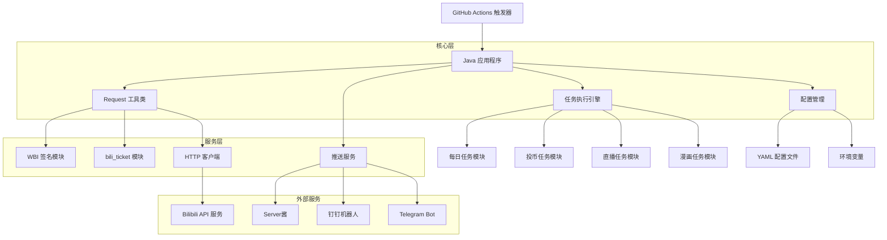
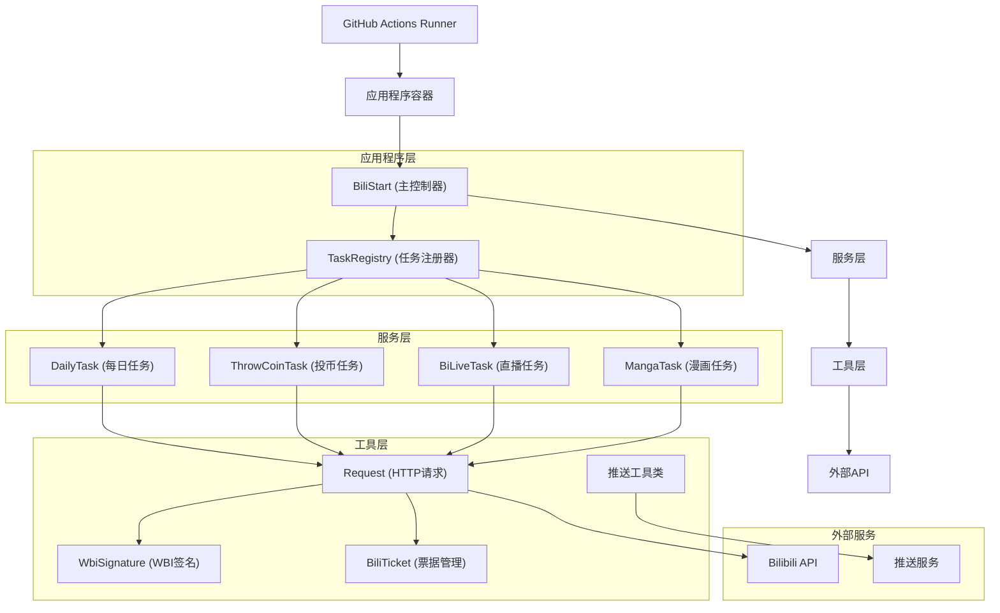
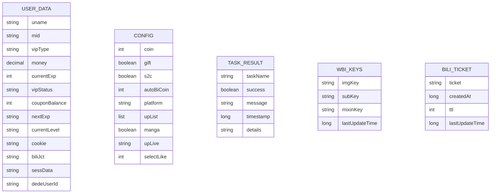

# Bilibili 打卡项目技术架构文档

## 1. 架构设计



## 2. 技术描述

* **前端**: 无（纯后端服务）

* **后端**: Java 11+ + Gradle 8.5

* **核心依赖**:

  * Fastjson2 2.0.43 (JSON处理)

  * Apache HttpClient 4.5.14 (HTTP请求)

  * Lombok (代码简化)

  * SnakeYAML 2.2 (配置文件解析)

  * Logback 1.4.14 (日志框架)

* **部署**: GitHub Actions + Docker

* **存储**: 无持久化存储（基于内存和配置文件）

## 3. 路由定义

本项目为后端服务，不涉及传统的Web路由，但包含以下主要执行流程：

| 执行流程          | 目的                  |
| ------------- | ------------------- |
| /startup      | 程序启动入口，环境检查和初始化     |
| /auth/verify  | 用户身份验证，Cookie有效性检查  |
| /tasks/daily  | 每日任务执行（观看、分享、投币）    |
| /tasks/live   | 直播相关任务（签到、礼物、银瓜子兑换） |
| /tasks/manga  | 漫画签到任务              |
| /tasks/vip    | 大会员相关任务（B币券领取和使用）   |
| /notification | 结果推送到各种通知渠道         |

## 4. API定义

### 4.1 核心API接口

#### 用户认证相关

```
GET https://api.bilibili.com/x/web-interface/nav
```

**请求参数**: 无

**响应示例**:

```json
{
  "code": 0,
  "message": "0",
  "ttl": 1,
  "data": {
    "isLogin": true,
    "uname": "用户名",
    "mid": 123456789,
    "money": 100.5,
    "level_info": {
      "current_level": 5,
      "current_exp": 12345
    },
    "wbi_img": {
      "img_url": "https://i0.hdslb.com/bfs/wbi/xxx.png",
      "sub_url": "https://i0.hdslb.com/bfs/wbi/yyy.png"
    }
  }
}
```

#### WBI签名相关

```
GET https://api.bilibili.com/x/web-interface/wbi/index/top/feed/rcmd
```

**请求参数**:

| 参数名    | 参数类型   | 是否必需  | 描述     |
| ------ | ------ | ----- | ------ |
| ps     | string | true  | 获取视频数量 |
| rid    | string | false | 分区ID   |
| w\_rid | string | true  | WBI签名  |
| wts    | string | true  | 时间戳    |

**响应示例**:

```json
{
  "code": 0,
  "message": "0",
  "ttl": 1,
  "data": {
    "item": [
      {
        "id": 123456789,
        "bvid": "BV1xx411c7mD",
        "title": "视频标题",
        "cid": 987654321
      }
    ]
  }
}
```

#### 投币相关

```
POST https://api.bilibili.com/x/web-interface/coin/add
```

**请求参数**:

| 参数名          | 参数类型   | 是否必需  | 描述     |
| ------------ | ------ | ----- | ------ |
| aid          | string | true  | 视频AV号  |
| multiply     | string | true  | 投币数量   |
| select\_like | string | false | 是否点赞   |
| csrf         | string | true  | CSRF令牌 |
| w\_rid       | string | true  | WBI签名  |
| wts          | string | true  | 时间戳    |

**响应示例**:

```json
{
  "code": 0,
  "message": "0",
  "ttl": 1,
  "data": {
    "like": true
  }
}
```

#### bili\_ticket获取

```
POST https://api.bilibili.com/bapis/bilibili.api.ticket.v1.Ticket/GenWebTicket
```

**请求参数**:

| 参数名  | 参数类型   | 是否必需 | 描述     |
| ---- | ------ | ---- | ------ |
| csrf | string | true | CSRF令牌 |

**响应示例**:

```json
{
  "code": 0,
  "message": "0",
  "ttl": 1,
  "data": {
    "ticket": "buvid3_xxx",
    "created_at": 1642780800,
    "ttl": 7200
  }
}
```

### 4.2 推送API

#### Server酱推送

```
POST https://sctapi.ftqq.com/{SCKEY}.send
```

**请求参数**:

| 参数名   | 参数类型   | 是否必需  | 描述   |
| ----- | ------ | ----- | ---- |
| title | string | true  | 推送标题 |
| desp  | string | false | 推送内容 |

#### 钉钉机器人推送

```
POST {DINGTALK_WEBHOOK_URL}
```

**请求参数**:

```json
{
  "msgtype": "text",
  "text": {
    "content": "推送内容"
  }
}
```

## 5. 服务器架构图



## 6. 数据模型

### 6.1 数据模型定义



### 6.2 核心数据结构

#### UserData 类

```java
public class UserData {
    private String uname;           // 用户名
    private String mid;             // 用户ID
    private String vipType;         // 会员类型
    private BigDecimal money;       // 硬币数量
    private Integer currentExp;     // 当前经验
    private String vipStatus;       // 会员状态
    private Integer couponBalance;  // B币券余额
    private String nextExp;         // 升级所需经验
    private String currentLevel;    // 当前等级
    
    // Cookie相关
    private String cookie;          // 完整Cookie字符串
    private String biliJct;         // CSRF令牌
    private String sessData;        // 会话数据
    private String dedeUserId;      // 用户ID
    
    // 单例模式
    private static UserData instance;
    public static UserData getInstance() {
        if (instance == null) {
            instance = new UserData();
        }
        return instance;
    }
}
```

#### Config 类

```java
public class Config {
    private Integer coin = 5;           // 每日投币数量
    private Boolean gift = true;        // 是否送礼物
    private Boolean s2c = true;         // 银瓜子兑换硬币
    private Integer autoBiCoin = 1;     // B币券使用方式
    private String platform = "android"; // 平台标识
    private List<String> upList;        // UP主列表
    private Boolean manga = true;       // 漫画签到
    private String upLive;              // 直播间UP主
    private Integer selectLike = 0;     // 投币时是否点赞
    
    // 单例模式
    private static Config instance;
    public static Config getInstance() {
        if (instance == null) {
            instance = new Config();
        }
        return instance;
    }
}
```

#### WBI签名数据结构

```java
public class WbiSignature {
    // WBI密钥重排映射表
    private static final int[] MIX_KEY_ENC_TAB = {
        46, 47, 18, 2, 53, 8, 23, 32, 15, 50, 10, 31, 58, 3, 45, 35, 27, 43, 5, 49,
        33, 9, 42, 19, 29, 28, 14, 39, 12, 38, 41, 13, 37, 48, 7, 16, 24, 55, 40,
        61, 26, 17, 0, 1, 60, 51, 30, 4, 22, 25, 54, 21, 56, 59, 6, 63, 57, 62, 11,
        36, 20, 34, 44, 52
    };
    
    // 缓存的密钥
    private static String imgKey = "";
    private static String subKey = "";
    private static long lastUpdateTime = 0;
    private static final long UPDATE_INTERVAL = 10 * 60 * 1000; // 10分钟
}
```

#### bili\_ticket数据结构

```java
public class BiliTicket {
    private static String cachedTicket = "";
    private static long lastUpdateTime = 0;
    private static final long TICKET_VALIDITY = 2 * 60 * 60 * 1000; // 2小时
    private static final int MAX_RETRIES = 3;
}
```

## 7. 关键算法实现

### 7.1 WBI签名算法

```java
/**
 * WBI签名生成算法
 * 1. 获取img_key和sub_key
 * 2. 生成mixin_key
 * 3. 构建查询字符串
 * 4. 计算MD5签名
 */
public static Map<String, String> getWbiSign(Map<String, Object> params) {
    // 1. 更新密钥
    updateKeys();
    
    // 2. 生成混合密钥
    String mixinKey = getMixinKey(imgKey + subKey);
    
    // 3. 添加时间戳
    long wts = System.currentTimeMillis() / 1000;
    params.put("wts", wts);
    
    // 4. 排序参数并构建查询字符串
    String query = params.entrySet().stream()
        .sorted(Map.Entry.comparingByKey())
        .map(entry -> {
            String value = String.valueOf(entry.getValue());
            // 过滤特殊字符
            value = value.replaceAll("[!'()*]", "");
            return entry.getKey() + "=" + value;
        })
        .collect(Collectors.joining("&"));
    
    // 5. 计算MD5签名
    String wRid = md5(query + mixinKey);
    
    Map<String, String> result = new HashMap<>();
    result.put("w_rid", wRid);
    result.put("wts", String.valueOf(wts));
    
    return result;
}

/**
 * 生成混合密钥
 */
private static String getMixinKey(String orig) {
    StringBuilder key = new StringBuilder();
    for (int i = 0; i < 32; i++) {
        if (MIX_KEY_ENC_TAB[i] < orig.length()) {
            key.append(orig.charAt(MIX_KEY_ENC_TAB[i]));
        }
    }
    return key.toString();
}
```

### 7.2 任务调度算法

```java
/**
 * 动态任务扫描和执行
 * 使用反射机制自动发现和执行任务
 */
private static void scanTask() {
    List<Class<?>> clazzList = new ArrayList<>();
    
    // 1. 扫描task包下的所有类
    TaskRegistry pack = new TaskRegistry() {
        @Override
        public void dealClass(String className) {
            try {
                Class<?> clazz = Class.forName(className);
                // 判断类是否实现了Task接口
                if (Arrays.stream(clazz.getInterfaces())
                    .anyMatch(taskI -> taskI.equals(Task.class))) {
                    clazzList.add(clazz);
                }
            } catch (Exception e) {
                log.error("反射获取对象错误: ", e);
            }
        }
    };
    pack.runTasks();
    
    // 2. 按类名排序确保执行顺序
    clazzList.stream()
        .sorted(Comparator.comparing(Class::getName))
        .forEach(clazz -> {
            try {
                // 3. 实例化并执行任务
                Constructor<?> constructor = clazz.getConstructor();
                Object object = constructor.newInstance();
                Method method = object.getClass().getMethod("run");
                method.invoke(object);
            } catch (Exception e) {
                log.error("任务执行失败 [{}]: ", clazz.getSimpleName(), e);
                hasFailures = true;
            }
        });
}
```

### 7.3 智能重试算法

```java
/**
 * 带指数退避的重试机制
 */
public static <T> T executeWithRetry(Supplier<T> operation, int maxRetries) {
    int attempt = 0;
    Exception lastException = null;
    
    while (attempt < maxRetries) {
        try {
            return operation.get();
        } catch (Exception e) {
            lastException = e;
            attempt++;
            
            if (attempt < maxRetries) {
                long waitTime = (long) Math.pow(2, attempt) * 1000; // 指数退避
                log.warn("操作失败，{}秒后重试 ({}/{}): {}", 
                    waitTime / 1000, attempt, maxRetries, e.getMessage());
                
                try {
                    Thread.sleep(waitTime);
                } catch (InterruptedException ie) {
                    Thread.currentThread().interrupt();
                    break;
                }
            }
        }
    }
    
    throw new RuntimeException("操作失败，已重试" + maxRetries + "次", lastException);
}
```

## 8. 性能优化策略

### 8.1 HTTP连接池

```java
// 使用连接池管理HTTP连接
private static final CloseableHttpClient httpClient = HttpClients.custom()
    .setMaxConnTotal(20)
    .setMaxConnPerRoute(10)
    .setConnectionTimeToLive(30, TimeUnit.SECONDS)
    .build();
```

### 8.2 缓存机制

```java
// WBI密钥缓存
private static final Map<String, Object> cache = new ConcurrentHashMap<>();
private static final long CACHE_TTL = 10 * 60 * 1000; // 10分钟

public static <T> T getFromCache(String key, Supplier<T> supplier) {
    CacheEntry entry = (CacheEntry) cache.get(key);
    if (entry != null && !entry.isExpired()) {
        return (T) entry.getValue();
    }
    
    T value = supplier.get();
    cache.put(key, new CacheEntry(value, System.currentTimeMillis() + CACHE_TTL));
    return value;
}
```

### 8.3 异步处理

```java
// 异步推送消息
CompletableFuture.runAsync(() -> {
    if (StringUtil.isNotBlank(System.getenv("SCKEY"))) {
        SendServer.send(System.getenv("SCKEY"));
    }
}).exceptionally(throwable -> {
    log.error("推送失败: ", throwable);
    return null;
});
```

## 9. 安全机制

### 9.1 敏感信息保护

```java
// 敏感信息脱敏
public static String hideString(String str, int prefixLen, int suffixLen, char maskChar) {
    if (StringUtil.isBlank(str) || str.length() <= prefixLen + suffixLen) {
        return str;
    }
    
    String prefix = str.substring(0, prefixLen);
    String suffix = str.substring(str.length() - suffixLen);
    String mask = String.valueOf(maskChar).repeat(str.length() - prefixLen - suffixLen);
    
    return prefix + mask + suffix;
}
```

### 9.2 请求频率控制

```java
// 请求频率限制
private static final RateLimiter rateLimiter = RateLimiter.create(1.0); // 每秒1个请求

public static JSONObject rateLimitedRequest(Supplier<JSONObject> requestSupplier) {
    rateLimiter.acquire(); // 获取许可
    return requestSupplier.get();
}
```

### 9.3 输入验证

```java
// 参数验证
public static void validateParams(Map<String, Object> params) {
    for (Map.Entry<String, Object> entry : params.entrySet()) {
        String key = entry.getKey();
        Object value = entry.getValue();
        
        // 检查SQL注入
        if (value instanceof String) {
            String strValue = (String) value;
            if (strValue.contains("'") || strValue.contains("--") || 
                strValue.toLowerCase().contains("script")) {
                throw new IllegalArgumentException("非法参数: " + key);
            }
        }
    }
}
```

## 10. 监控和日志

### 10.1 结构化日志

```java
// 使用结构化日志记录关键信息
log.info("任务执行 - 任务名: {}, 状态: {}, 耗时: {}ms, 详情: {}",
    taskName, success ? "成功" : "失败", duration, details);
```

### 10.2 性能监控

```java
// 方法执行时间监控
public static <T> T monitorExecution(String operationName, Supplier<T> operation) {
    long startTime = System.currentTimeMillis();
    try {
        T result = operation.get();
        long duration = System.currentTimeMillis() - startTime;
        log.info("操作完成 - 名称: {}, 耗时: {}ms", operationName, duration);
        return result;
    } catch (Exception e) {
        long duration = System.currentTimeMillis() - startTime;
        log.error("操作失败 - 名称: {}, 耗时: {}ms, 错误: {}", 
            operationName, duration, e.getMessage());
        throw e;
    }
}
```

### 10.3 健康检查

```java
// 系统健康检查
public static HealthStatus checkHealth() {
    HealthStatus status = new HealthStatus();
    
    // 检查Cookie有效性
    try {
        JSONObject navResp = Request.get("https://api.bilibili.com/x/web-interface/nav");
        status.setCookieValid("0".equals(navResp.getString("code")));
    } catch (Exception e) {
        status.setCookieValid(false);
    }
    
    // 检查网络连接
    status.setNetworkConnected(isNetworkAvailable());
    
    // 检查内存使用
    Runtime runtime = Runtime.getRuntime();
    long usedMemory = runtime.totalMemory() - runtime.freeMemory();
    status.setMemoryUsage(usedMemory / (1024 * 1024)); // MB
    
    return status;
}
```

***

\*\*文档版
